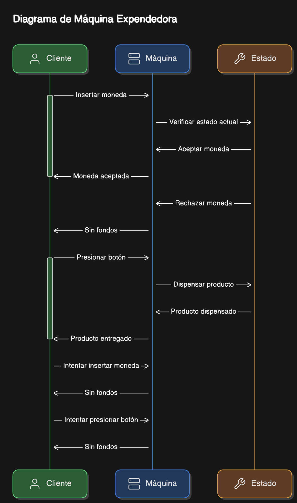

# Patrón State

Explora el **Patrón de Diseño State** y aprende cómo gestionar el comportamiento dinámico de tus aplicaciones de forma más clara y estructurada. Este patrón permite cambiar el estado de un objeto en tiempo de ejecución, mejorando la flexibilidad y mantenibilidad del código.

## ¿Qué es el Patrón State?

El Patrón de Diseño State es un patrón de comportamiento en programación orientada a objetos que permite a un objeto cambiar su comportamiento cuando su estado interno cambia. Es como si el objeto "cambiara de clase" en tiempo de ejecución.

En este patrón, cada estado se encapsula en una clase separada que define el comportamiento asociado a ese estado. Esto facilita agregar nuevos estados o modificar los existentes sin alterar el código principal, promoviendo un diseño más limpio, flexible y fácil de mantener.

Se utiliza comúnmente en aplicaciones donde el comportamiento depende de un contexto cambiante, como máquinas de estado, sistemas de control o interfaces con diferentes modos de operación.

### ¿Por qué usar el Patrón State?
Usar el Patrón State ofrece varias ventajas, especialmente en aplicaciones que necesitan manejar comportamientos dinámicos y complejos. Algunas razones para implementarlo incluyen:

- **Código más limpio y estructurado:**
    Encapsular cada estado en una clase separada reduce la necesidad de largos bloques condicionales (if-else o switch), mejorando la legibilidad y el mantenimiento del código.

- **Facilidad para agregar o modificar estados:**
    Al estar cada estado encapsulado, agregar nuevos estados o cambiar el comportamiento de uno existente no afecta el resto del sistema.

- **Mayor flexibilidad:**
    Permite que un objeto cambie su comportamiento dinámicamente en tiempo de ejecución sin alterar su estructura o lógica central.

- **Principio de responsabilidad única:**
    Cada clase de estado se ocupa de definir un comportamiento específico, alineándose con este principio de diseño sólido (SOLID).

- **Escalabilidad:**
    Ideal para sistemas donde los estados pueden crecer en cantidad o complejidad, como máquinas de estado, videojuegos, interfaces de usuario o sistemas de control.
---
## Ejemplo práctico:

El patrón de diseño **State** permite que un objeto altere su comportamiento cuando cambia su estado interno. En el contexto de una máquina expendedora, este patrón se utiliza para gestionar diferentes comportamientos según el estado de la máquina, como esperar una moneda, estar en funcionamiento para dispensar productos o estar fuera de servicio debido a la falta de fondos o productos. Este enfoque simplifica el código al evitar múltiples condicionales, permitiendo que cada estado tenga su propio conjunto de acciones y facilitando el cambio de comportamientos de manera flexible. A continuación se presenta un ejemplo que ilustra cómo implementar este patrón en una máquina expendedora.

### Implementación en Python:

```python
# Clase Estado base
class VendingMachineState:
    def insert_coin(self):
        pass

    def press_button(self):
        pass

    def dispense_item(self):
        pass

# Estado "Esperando"
class WaitingState(VendingMachineState):
    def insert_coin(self):
        print("Moneda insertada. ¡Listo para elegir producto!")
    
    def press_button(self):
        print("Primero debes insertar una moneda.")
    
    def dispense_item(self):
        print("No se puede entregar el producto sin presionar el botón.")

# Estado "En funcionamiento"
class WorkingState(VendingMachineState):
    def insert_coin(self):
        print("Ya se insertó una moneda. Elige tu producto.")
    
    def press_button(self):
        print("Botón presionado. ¡Espere mientras se dispensa el producto!")
    
    def dispense_item(self):
        print("Producto dispensado. ¡Disfrútalo!")

# Estado "Sin fondos"
class OutOfFundsState(VendingMachineState):
    def insert_coin(self):
        print("No hay fondos suficientes en la máquina.")
    
    def press_button(self):
        print("La máquina está fuera de servicio.")
    
    def dispense_item(self):
        print("No se puede dispensar nada, la máquina no tiene productos disponibles.")

# Contexto: La máquina expendedora
class VendingMachine:
    def __init__(self):
        self.state = WaitingState()

    def set_state(self, state):
        self.state = state

    def insert_coin(self):
        self.state.insert_coin()

    def press_button(self):
        self.state.press_button()

    def dispense_item(self):
        self.state.dispense_item()

# Usando el patrón State
machine = VendingMachine()

# Estado Inicial: Esperando
print("Estado Inicial: Esperando...")
machine.insert_coin()
machine.press_button()
machine.dispense_item()

# Cambiando a estado 'En funcionamiento'
print("\nCambiando a estado 'En funcionamiento'...")
machine.set_state(WorkingState())
machine.insert_coin()
machine.press_button()
machine.dispense_item()

# Cambiando a estado 'Sin fondos'
print("\nCambiando a estado 'Sin fondos'...")
machine.set_state(OutOfFundsState())
machine.insert_coin()
machine.press_button()
machine.dispense_item()

```
## Diagrama State 
El diagrama muestra cómo el cliente interactúa con la máquina, cómo la máquina cambia de estado y cómo responde el sistema a cada acción del cliente.




