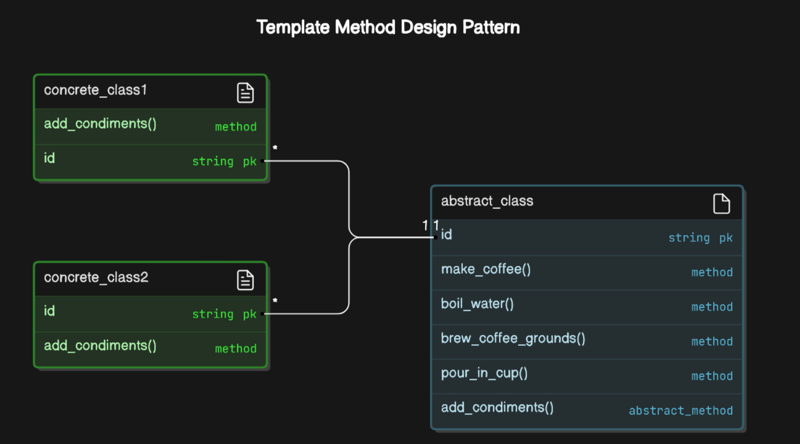

# Template Method

Explora el **Patrón de Diseño Template Method** y descubre cómo estructurar algoritmos de manera eficiente y flexible. Este patrón permite definir la secuencia de pasos de un algoritmo en un método base, mientras que deja que las subclases implementen los detalles específicos de cada paso. De esta forma, se asegura que la estructura general del proceso se mantenga intacta, mientras que se permite personalizar ciertas partes del algoritmo según sea necesario.

## ¿Qué es el Template Method?
El patrón Template Method es un patrón de comportamiento que define la estructura de un algoritmo en un método, pero permite que las subclases implementen pasos específicos de ese algoritmo sin cambiar su estructura general. En otras palabras, el patrón establece un "esqueleto" de un proceso en un método base, y las subclases pueden proporcionar implementaciones detalladas para algunos de los pasos del proceso. Este patrón es útil cuando se tiene un proceso común que necesita ser personalizado en ciertas partes, pero sin alterar la secuencia de ejecución general.

## ¿Por qué usar el Template Method?
Usar el Patrón Template Method ofrece varias ventajas, especialmente en escenarios donde se necesita controlar la estructura de un algoritmo pero permitiendo personalización. Algunas razones para implementarlo incluyen:

- **Reutilización de código:**
    Define la estructura común de un algoritmo en una clase base, lo que permite reutilizar el código en varias subclases, evitando duplicación.

- **Flexibilidad:**
    Aunque la estructura general del algoritmo está definida, las subclases pueden sobrescribir métodos específicos para adaptar el comportamiento sin modificar el flujo global del algoritmo.

- **Control del flujo de ejecución:**
    El patrón garantiza que el algoritmo siga una secuencia definida de pasos, asegurando que los detalles se ajusten a la lógica general establecida en la clase base.

- **Principio de diseño sólido:**
    Alineado con el principio de responsabilidad única, ya que las subclases se encargan solo de los pasos específicos, mientras que la clase base se ocupa del proceso global.

- **Facilidad de mantenimiento y extensión:**
    Permite modificar o agregar nuevas implementaciones de pasos sin alterar la estructura general del algoritmo, lo que facilita la evolución del sistema.

Este patrón es ideal para escenarios donde la estructura del proceso es constante, pero se necesitan detalles personalizables, como en procesos de fabricación, generación de informes, o algoritmos de procesamiento en varias fases.

---
## Ejemplo práctico:

El patrón de diseño Template Method define la estructura de un algoritmo en un método base, pero permite que las subclases implementen pasos específicos de ese algoritmo. En este ejemplo, ilustramos cómo usar el patrón Template Method para simular la preparación de diferentes tipos de bebidas en una máquina de café. La preparación de cada bebida sigue un proceso común, pero las subclases pueden personalizar algunos pasos, como los ingredientes específicos o el tiempo de preparación. A continuación se presenta un ejemplo que muestra cómo implementar el **Patrón de Diseño Template Method** para la preparación de café, con un proceso común y pasos personalizables.

### Implementación en Python:

```python
# Clase base que define el algoritmo
class CoffeeMaker:
    def make_coffee(self):
        self.boil_water()        # Paso 1
        self.brew_coffee_grounds()  # Paso 2
        self.pour_in_cup()       # Paso 3
        self.add_condiments()    # Paso 4 (personalizable)

    def boil_water(self):
        print("Hervir agua.")

    def brew_coffee_grounds(self):
        print("Preparando los granos de café.")

    def pour_in_cup(self):
        print("Vertiendo el café en la taza.")

    def add_condiments(self):
        pass  # Este paso será personalizado por las subclases

# Subclase para preparar café negro
class BlackCoffee(CoffeeMaker):
    def add_condiments(self):
        print("No se le agrega ningún condimento. Café negro listo.")

# Subclase para preparar café con leche
class CoffeeWithMilk(CoffeeMaker):
    def add_condiments(self):
        print("Añadiendo leche al café.")

# Subclase para preparar café con azúcar
class CoffeeWithSugar(CoffeeMaker):
    def add_condiments(self):
        print("Añadiendo azúcar al café.")

# Usando el patrón Template Method
print("Preparando Café Negro:")
black_coffee = BlackCoffee()
black_coffee.make_coffee()

print("\nPreparando Café con Leche:")
coffee_with_milk = CoffeeWithMilk()
coffee_with_milk.make_coffee()

print("\nPreparando Café con Azúcar:")
coffee_with_sugar = CoffeeWithSugar()
coffee_with_sugar.make_coffee()


```
## Diagrama Template Method
El diagrama muestra cómo el **Patrón de Diseño Template Method** organiza el flujo de un algoritmo en una **Clase Abstracta**, que define la estructura general del proceso (en este caso, hacer café) a través del método `make_coffee()`. La **Clase Abstracta** contiene pasos comunes que no cambian, como `boil_water()`, `brew_coffee_grounds()`, y `pour_in_cup()`, mientras que el método `add_condiments()` es abstracto y debe ser implementado por las subclases.

Las **subclases concretas** (`ConcreteClass1` y `ConcreteClass2`) heredan de la **Clase Abstracta** y sobrescriben el método `add_condiments()` para personalizar cómo se añaden los condimentos en cada caso.

La relación entre las clases se indica por la flecha de herencia, mostrando que ambas subclases heredan de la clase base y personalizan una parte del algoritmo sin cambiar su estructura general.




