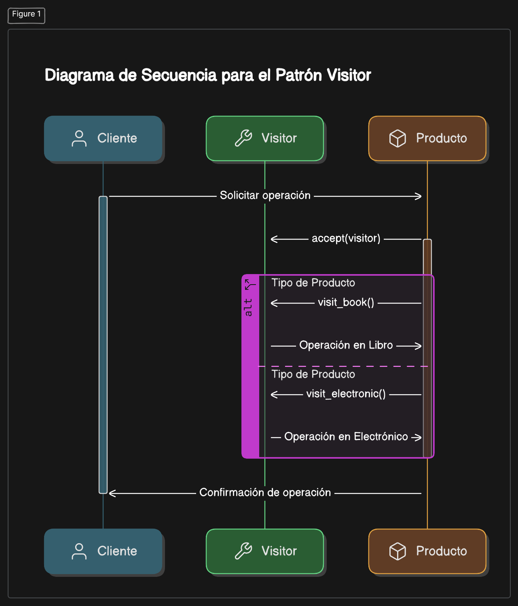

# Patron Vistor

Descubre cómo estructurar operaciones de manera eficiente y flexible sobre una jerarquía de objetos heterogéneos. Este patrón permite definir operaciones específicas en una clase separada llamada "Visitor", mientras que los elementos de la estructura aceptan al visitante, delegándole la lógica de las operaciones. De esta forma, se asegura que la jerarquía de clases permanezca sin cambios, mientras se pueden agregar nuevas funcionalidades fácilmente sin modificar su estructura.

## ¿Qué es el Patrón Visitor?

El patrón Visitor es un patrón de diseño de comportamiento que permite separar un conjunto de operaciones de las estructuras de objetos sobre las cuales operan. Define un "visitante" que contiene todas las operaciones, mientras que los objetos de la estructura aceptan al visitante para ejecutar esas operaciones específicas.

En otras palabras, este patrón permite realizar diferentes operaciones sobre objetos de una jerarquía sin modificar sus clases, promoviendo así la extensión de funcionalidades sin alterar el código existente.

## Estructura del Visitor

El patrón Visitor define una separación de responsabilidades entre:
- **La estructura del objeto:**
 Las clases que forman la jerarquía sobre la que se realizarán las operaciones.
- **El visitante (Visitor):**
 Una clase externa que encapsula la lógica de las operaciones que se aplican a la estructura.

## ¿Cómo funciona el Visitor?
- **Interfaz Visitor:**
 Define las operaciones que se pueden realizar en cada tipo de objeto de la estructura.
- **Visitantes concretos:**
 Implementan operaciones específicas.
- **Elemento base:**
 Define un método accept(visitor) que permite a los visitantes realizar sus operaciones.
- **Elementos concretos:**
Implementan el método accept(visitor) y proporcionan al visitante acceso a su estado interno.

Este patrón es útil cuando necesitas aplicar múltiples operaciones sobre una jerarquía de objetos sin modificar las clases de los objetos o añadir complejidad mediante condicionales.


## ¿Por qué usar el Patron Visitor?
Usar el patrón Visitor ofrece una serie de ventajas, especialmente en sistemas donde se necesita realizar múltiples operaciones sobre una jerarquía de clases sin alterar su estructura. Algunas razones clave para implementarlo incluyen:

- **Extensibilidad:** Puedes añadir nuevas operaciones creando nuevas clases de visitantes sin modificar las clases existentes.
- **Claridad y mantenimiento:** Centraliza las operaciones, evitando condicionales dispersos que dependen del tipo de objeto.
- **Principio abierto/cerrado:** Las clases de objetos son abiertas para extensiones (nuevos visitantes) pero cerradas para modificaciones.

---
## Ejemplo práctico:
Supongamos que tenemos una jerarquía de productos en una tienda y necesitamos realizar varias operaciones, como calcular impuestos y generar reportes detallados, sin modificar las clases de los productos.

### Implementación en Python:

```python
from abc import ABC, abstractmethod

# Interfaz del Elemento
class Product(ABC):
    @abstractmethod
    def accept(self, visitor):
        pass

# Clases concretas
class Book(Product):
    def __init__(self, title, price):
        self.title = title
        self.price = price

    def accept(self, visitor):
        visitor.visit_book(self)

class Electronic(Product):
    def __init__(self, brand, price):
        self.brand = brand
        self.price = price

    def accept(self, visitor):
        visitor.visit_electronic(self)

# Interfaz del Visitor
class Visitor(ABC):
    @abstractmethod
    def visit_book(self, book):
        pass

    @abstractmethod
    def visit_electronic(self, electronic):
        pass

# Visitante concreto: Calcular impuestos
class TaxVisitor(Visitor):
    def visit_book(self, book):
        tax = book.price * 0.1
        print(f"Tax for Book '{book.title}': {tax}")

    def visit_electronic(self, electronic):
        tax = electronic.price * 0.2
        print(f"Tax for Electronic '{electronic.brand}': {tax}")

# Visitante concreto: Generar reporte
class ReportVisitor(Visitor):
    def visit_book(self, book):
        print(f"Report - Book: {book.title}, Price: {book.price}")

    def visit_electronic(self, electronic):
        print(f"Report - Electronic: {electronic.brand}, Price: {electronic.price}")

# Uso del patrón
products = [
    Book("Clean Code", 50),
    Electronic("Laptop", 1200)
]

tax_visitor = TaxVisitor()
report_visitor = ReportVisitor()

for product in products:
    product.accept(tax_visitor)
    product.accept(report_visitor)


```
## Diagrama Visitor

Este diagrama de secuencia explica el funcionamiento del **Patrón de Diseño Visitor**, que permite realizar diferentes operaciones sobre objetos sin modificar sus clases. El proceso inicia cuando el **Cliente** solicita una operación sobre un **Producto** (por ejemplo, un libro o un producto electrónico). El producto acepta al **Visitor** (objeto que contiene la lógica de la operación) mediante el método `accept(visitor)`. Dependiendo del tipo de producto, el Visitor ejecuta un método específico: `visit_book()` si es un libro o `visit_electronic()` si es un producto electrónico, realizando así la operación correspondiente (como calcular un precio o generar un reporte). Finalmente, el cliente recibe una confirmación de que la operación se completó. Este patrón facilita agregar nuevas operaciones sin modificar las clases de los productos, lo que mejora la flexibilidad y el mantenimiento del sistema.




